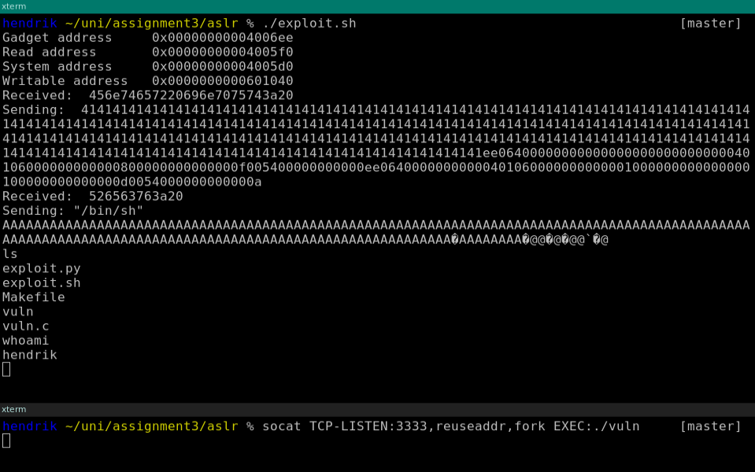

# 1
## a
The offsets of the `read` and `system` functions can be found like this:

```
objdump -d vuln | grep -oP '^[\da-z]+(?= <read@plt>)'
objdump -d vuln | grep -oP '^[\da-z]+(?= <system@plt>)'
```

In our case they were 0x4005f0 for `read`, and 0x4005d0 for `system`.

## b
i. The gadget pops the top 3 elements from the stack into the registers `%rdi, %rsi`, and `%rdx` respectively.

	These registers are the first 3 registers to be used for passing integers or pointers, according to the Linux64 ABI [^1]. It can therefore be used to call a function that takes a combination of up to 3 integers or pointers as parameters.

[^1]: [System V Application Binary Interface](https://software.intel.com/sites/default/files/article/402129/mpx-linux64-abi.pdf) page 21

ii. The gadget's address can be found by decompiling the vulnerable program, and locating the helper function, and then finding the four Assembly instructions in that function. This can be accomplished by running `objdump -d vuln | grep -zoP '<helper>:\n(.+\n)+'`, and the looking for the address of `pop %rdi`.

	We found the address 0x4006ee.

## c
To find a suitable writable memory address, we look at the section headers of the vulnerable binary, and look for a `.data` section at least 8 bytes long. We used the following command:

`readelf -S vuln | grep -PA 1 ' \.data '`

We found a data section that is both writable, and bigger than 8 bytes, so we used its address: 0x601040.

## d
Stage 1 of the attack uses the `write` function to write the string `"/bin/sh"` into the writable buffer we found. The first stage is equivalent to `write(0, writable_buffer, 8)` which reads 8 bytes from stdin to the writable buffer.

Stage 2 makes use of this, by calling the `system` function with a pointer to the buffer where `"/bin/sh"` was written in stage 1. This leads to the `system` function executing the shell. The second stage is equivalent to `system(writable_buffer)`, which is itself equivalent to `system("bin/sh")`.

## e
We were able to successfully get a shell by executing the attack. Here is a screenshot proving this:



We made a script automating the search for the `read`, `system`, and gadget addresses. The only thing you need to manually find is the address of the writable buffer, as this proved to be hard to automate.

To execute the automated attack, you can simply run `./exploit.sh`, as shown in the screenshot. The script gathers the required addresses, and executes `exploit.py` with the correct arguments.

When we execute the attack, the following sequence of events happens:

1. We overflow the buffer `buf`, such that the return address of the gadget is written over the return address of the `vuln` function, in which the buffer exists.
2. The `vuln` function tries to return, but returns to the gadget, instead of to `main`, because we overwrote the return address.
3. The gadget pops the three next values on the stack into registers `%rdi, %rsi`, and `%rdx`. These values are 0, a pointer to the writable buffer, and 8.
4. The gadget returns to the `read` function, because its address is the next value on the stack.
5. The `read` function looks at registers `%rdi, %rsi`, and `%rdx`, where it expects its arguments, and finds 0, the address of the writable buffer, and 8.
6. The `read` function tries to write 8 bytes from file descriptor 0 (= stdin), to the writable buffer. There is no input available at this time, so it blocks.

   We need 8 bytes, because C strings are NULL-terminated.
7. We write `"/bin/sh"` to the stdin of `vuln`.
8. The `read` function receives `"/bin/sh"`, and puts it into the writable buffer.
9. The `read` functions returns to the gadget, because its address is the next item on the stack.
10. The gadget pops the next 3 values on the stack into registers `%rdi, %rsi`, and `%rdx`. The next 3 items are the address of the writable buffer, 1, and 1.

    We only need these 1s as padding, because our gadget pops 3 values. Alternatively we could find another gadget that does `pop %rdi; ret`, then we would not need padding.
11. That gadget returns to the `system` function, whose address in next on the stack.
12. The `system` function looks into register `%rdi` for its first argument, and finds a pointer to the writable buffer.
13. The `system` functions finds the string `"/bin/sh"` in the writable buffer, so it executes a shell.

# 2

Our Makefile uses your default C compiler, so if you cannot compile the quines, you may have to use `gcc` explicitly (`CC=gcc make`). We successfully tested both included quines with GCC 7.2.0.

We started with this quine by Dario Dariol:

```
main(a){printf(a="main(a){printf(a=%c%s%c,34,a,34);}",34,a,34);}
```

The idea is pretty simple. The main function solely consists of a print statement, that prints a string `a` which is the program's code itself, except for the string `a`.

In place of the string `a` we have format string `%c%s%c`, which expects a `char`, a string (= pointer to a `char`), and another `char`. The two characters are used to print `"`, because we cannot put real quotes there, as they have a special meaning in C. `char`s are just bytes in C, and 34 is the byte corresponding to the character `"`. The string is then given a reference to `a`, so now the string contains the whole code of the C program, which is then printed.

Normally we would have to import `stdio.h` to provide the `printf` function, and `gcc` complains about this, but it compiles it anyway. If you do not declare the type of a function explicitly in C, then it defaults to type `int`, so we can just write `main(…) { … }`.

Now that we understand the program, let's run it.

```
make quine1
./quine1
```

We get a segmentation fault. Why is that?

The type of `a` is not explicitly defined, but it is listed as a parameter of the main function, which should not be necessary. I expect that this quine made use of an implicit type given to `a` when used as a parameter to the main function, but this behavior does not seem to hold anymore.

We made the type of `a` explicit like this:

```
main(char *a){printf(a="main(char *a){printf(a=%c%s%c,34,a,34);}",34,a,34);}
```

Now the program works. Based on this we also made a second quine completely on our own, using the same principle:

```
main(){char *c="main(){char *c=%c%s%c;printf(c,34,c,34);}";printf(c,34,c,34);}
```

# 3
## a
We decided to use the file permission of some file as our covert channel. The file permissions range from octal 000 to octal 777, which are 9 bits we can modify.

To demonstrate the concept we made a covert sender script in Python, that generates random 9 bit long numbers, encodes them as file permission on the file `./channel`, then sleeps a second, and starts again. Of course you could also send something more useful, like bits of a file, or any other binary data broken into chunks of 9 bits.

We also made a Python covert receiver that reads the file permissions from the `./channel` file and prints the decimal number they encode. However since there is no easy way to listen for file changes in Python without relying on third party libraries, we had to use polling. This approach is not very reliable, as there could be timing problems. Additionally you need to check when the file changed on every poll, because you need to know whether the file's attributes were updated since it was checked the last time. Also the latency when processing the input may be as high as the polling rate.

In C you can make use of the inotify API to wait until the file attributes are changed, so we also implemented a blocking, event based covert receiver in C. Using the event based API solved all of the problems with the polling receiver.

To run the covert channel demo create the `channel` file, and make sure it can be accessed by another user, from user1:

```
user1 $ make channel
```

Then compile and start the receiver with user2:

```
user2 $ make covert_receiver
user2 $ ./covert_receiver /path/to/channel
```

The `channel` file is created in the home directory of user1, which should be `/home/user1/channel`.

After you started the sender as user1 with `./covert_sender.py`, you should see that the receiver receives the same numbers that the sender sends.

After you are done, do not forget to run `make clean` as user1, otherwise that user's home directory will be left with permissions `drwxr-xr-x`.

## b

We send numbers from user1 with the covert sender, and received them as user2 with the covert receiver. The communication worked.

Changing file attributes is very normal task, and is usually not logged. You need to set up special auditing to log these changes. We were not able to identify the covert channel with either `journalctl` or `dmesg`.
